# Tính năng và Chức năng - DevShare Lite

## Chức năng chính đã thực hiện

### 1. Hệ thống Xác thực và Quản lý Tài khoản

#### 1.1 Đăng ký tài khoản
- **Mô tả:** Form đăng ký với validation đầy đủ
- **Tính năng:**
  - Kiểm tra tính duy nhất của username và email
  - Validation password strength
  - Gửi email xác thực tự động
  - UI responsive với Ant Design

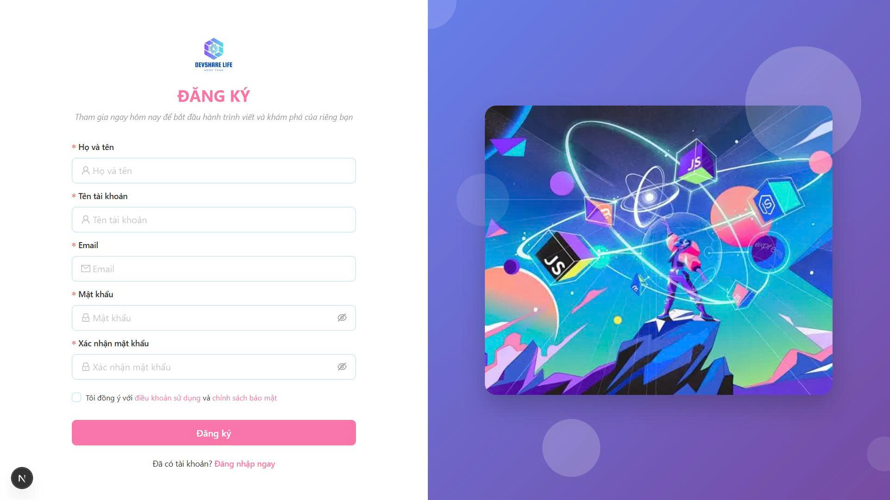

#### 1.2 Xác thực email
- **Mô tả:** Hệ thống xác thực email với mã OTP
- **Tính năng:**
  - Gửi mã xác thực 6 số qua email
  - Thời gian hết hạn mã (60 phút)
  - Tính năng gửi lại mã xác thực
  - Template email đẹp mắt với Handlebars

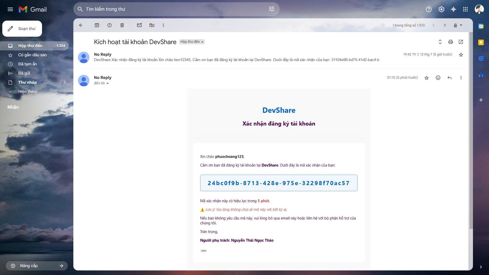
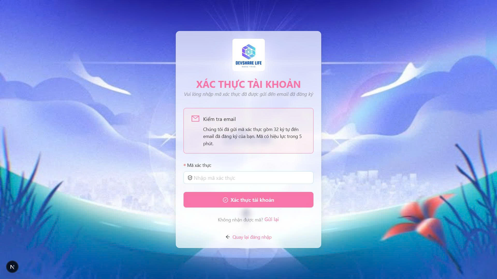

#### 1.3 Đăng nhập
- **Mô tả:** Form đăng nhập an toàn với JWT
- **Tính năng:**
  - Authentication với JWT tokens
  - Remember me functionality
  - Error handling chi tiết
  - Session management với NextAuth.js

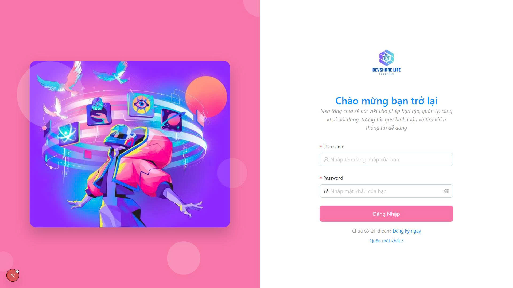

### 2. Dashboard và Quản lý Nội dung

#### 2.1 Dashboard chính
- **Mô tả:** Trang tổng quan với navigation sidebar
- **Tính năng:**
  - Sidebar navigation responsive
  - User profile dropdown
  - Quick stats overview
  - Modern UI với gradients

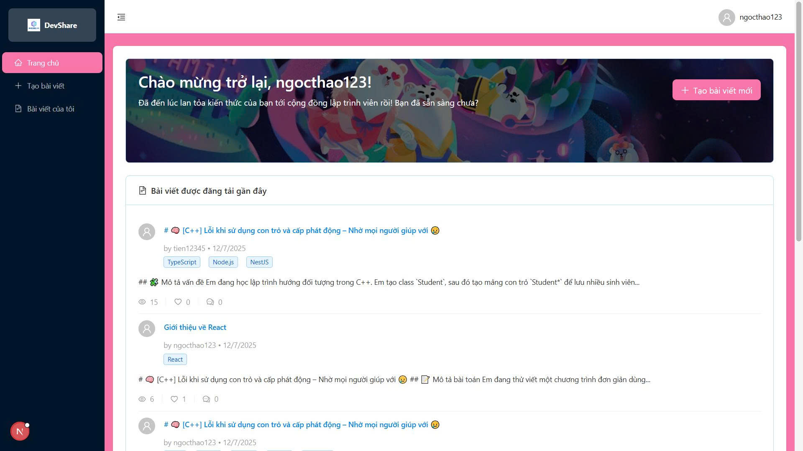

#### 2.2 Danh sách bài viết cá nhân
- **Mô tả:** Quản lý bài viết của người dùng
- **Tính năng:**
  - Hiển thị bài viết theo trạng thái (Draft, Published, Archived)
  - Filter và search functionality
  - Quick actions (Edit, View, Delete)
  - Status badges với màu sắc phân biệt
  - Pagination support

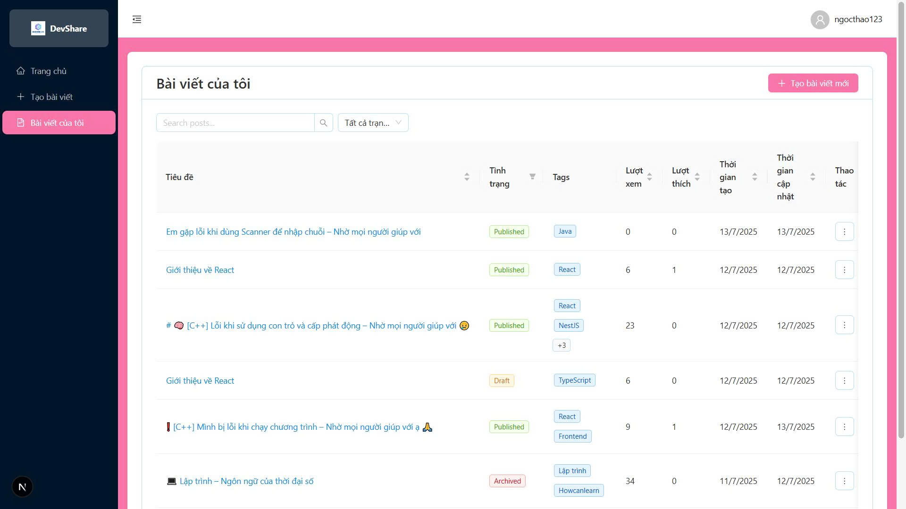

### 3. Tạo và Chỉnh sửa Bài viết

#### 3.1 Editor bài viết
- **Mô tả:** WYSIWYG editor với Markdown support
- **Tính năng:**
  - Real-time Markdown preview
  - Syntax highlighting với rehype-highlight
  - Tag system với predefined tags
  - Image upload với Cloudinary integration
  - Auto-save draft functionality
  - Status management (Draft/Published/Archived)

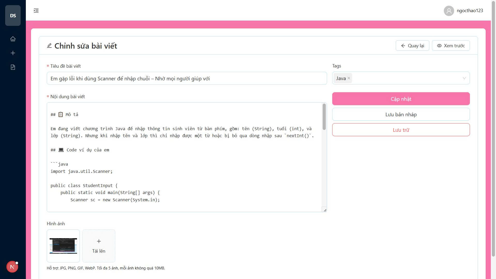

#### 3.2 Preview mode
- **Mô tả:** Xem trước bài viết trước khi publish
- **Tính năng:**
  - Split-screen view (Editor + Preview)
  - Markdown rendering với GitHub-flavored markdown
  - Code syntax highlighting
  - Responsive preview

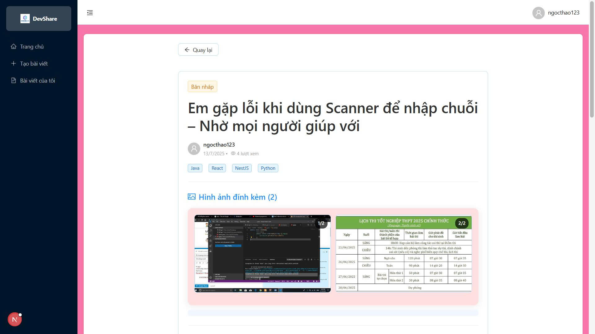

### 4. Hiển thị và Tương tác với Bài viết

#### 4.1 Chi tiết bài viết
- **Mô tả:** Trang hiển thị nội dung bài viết đầy đủ
- **Tính năng:**
  - Markdown rendering với styling đẹp mắt
  - Meta information (Author, Date, Views, Likes)
  - Social interactions (Like/Unlike)
  - Tag display
  - Author profile link

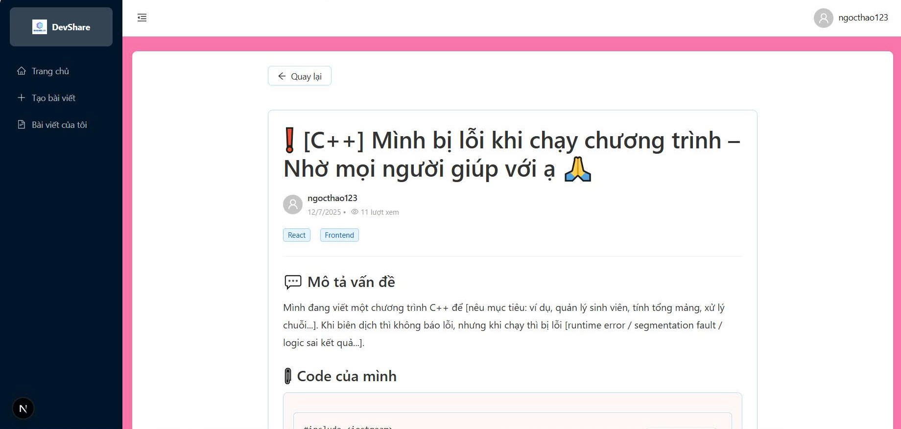

#### 4.2 Hệ thống Like
- **Mô tả:** Tương tác xã hội với bài viết
- **Tính năng:**
  - Like/Unlike posts
  - Real-time like count update
  - Heart animation effects
  - Prevention of liking own posts

### 5. Hệ thống Bình luận Đa cấp

#### 5.1 Comments interface
- **Mô tả:** Hệ thống bình luận phân cấp
- **Tính năng:**
  - Threaded comments (replies)
  - Real-time comment submission
  - Edit/Delete own comments
  - User avatars và timestamps
  - Rich text support

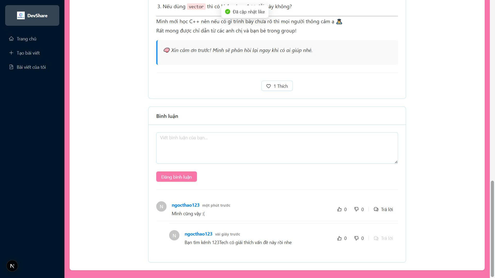

### 6. Profile và Social Features

#### 6.1 User profile
- **Mô tả:** Trang profile người dùng
- **Tính năng:**
  - Avatar display
  - Bio information
  - Posts từ user
  - Follow/Unfollow functionality
  - Follower/Following counts

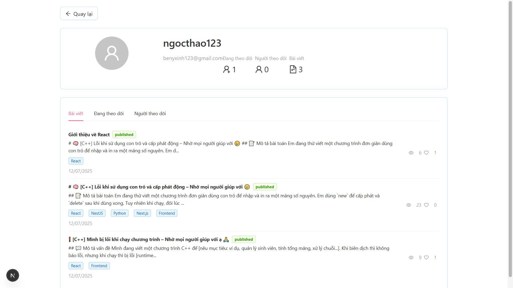

#### 6.2 Follow system
- **Mô tả:** Theo dõi tác giả yêu thích
- **Tính năng:**
  - Follow/Unfollow users
  - Following/Followers lists
  - Profile navigation
  - Social statistics

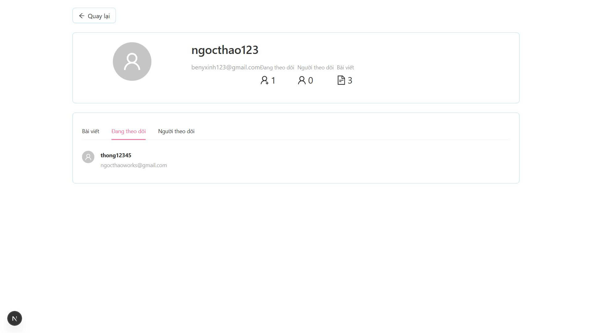
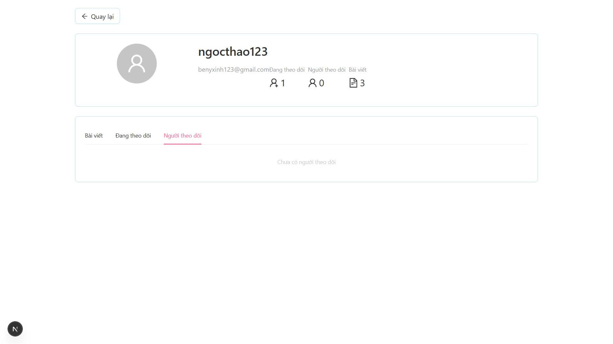

### 7. Tìm kiếm và Khám phá

#### 7.1 Trang chủ với feed
- **Mô tả:** Hiển thị bài viết mới nhất
- **Tính năng:**
  - Latest published posts
  - Author information
  - Pagination

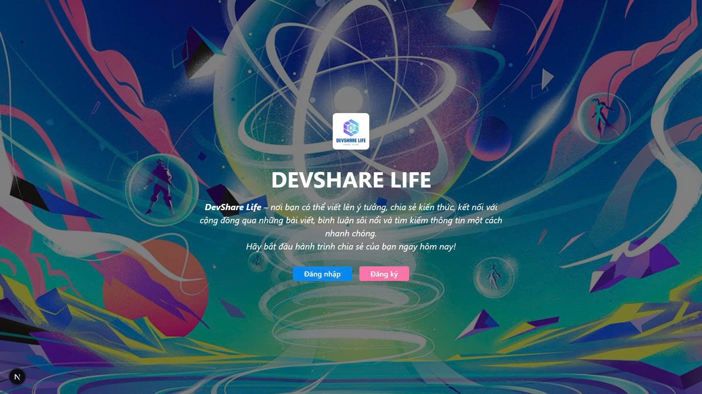

#### 7.2 Search functionality
- **Mô tả:** Tìm kiếm bài viết và tác giả
- **Tính năng:**
  - Full-text search
  - Search by tags
  - Author search
  - Result filtering

## Chức năng nâng cao đã thực hiện

### 1. **Real-time Features**
- **WebSocket integration** cho live comments
- **Real-time notifications** cho likes và comments
- **Live preview** trong editor

### 2. **Advanced Editor Features**
- **Markdown với GitHub-flavored syntax**
- **Code syntax highlighting** với rehype-highlight
- **Image drag & drop upload**
- **Auto-save functionality**
- **Split-screen preview mode**

### 3. **Social Media Features**
- **Hierarchical comment system** (unlimited nesting)
- **Vote system** cho comments (Upvote/Downvote)
- **Follow/Unfollow system**
- **User profile pages**
- **Social statistics** (followers, following, posts count)

### 4. **Performance Optimizations**
- **Image optimization** với Cloudinary
- **Lazy loading** cho images
- **Pagination** cho large datasets
- **Database indexing** cho performance
- **Caching strategies** với MongoDB

### 5. **Security Enhancements**
- **JWT token-based authentication**
- **Password hashing** với bcrypt
- **Input validation** với class-validator
- **CORS configuration**
- **Rate limiting** (planned)

### 6. **UI/UX Improvements**
- **Responsive design** cho tất cả devices
- **Dark mode support** (planned)
- **Accessibility features**
- **Loading states** và spinners
- **Error boundaries** với graceful fallbacks

### 7. **Developer Experience**
- **TypeScript** full-stack implementation
- **ESLint** và code formatting
- **API documentation** với Swagger
- **Environment configuration**
- **Docker support** (planned)

## Vấn đề gặp phải và Giải pháp

### 1. **Performance Issues**

#### Vấn đề:
- Database queries chậm khi có nhiều comments
- Large images ảnh hưởng loading time
- Memory leaks trong React components

#### Giải pháp:
- **Database optimization:** Implement compound indexes
- **Image optimization:** Sử dụng Cloudinary transformations
- **Code splitting:** Lazy loading components
- **Memory management:** Proper cleanup trong useEffect

### 2. **Authentication Complexity**

#### Vấn đề:
- Session management phức tạp
- JWT token refresh logic
- NextAuth.js configuration challenges

#### Giải pháp:
- **Simplified auth flow:** Streamlined login/logout process
- **Automatic token refresh:** Background token renewal
- **Better error handling:** Clear error messages cho users

### 3. **Comment System Complexity**

#### Vấn đề:
- Hierarchical comments performance
- State management cho nested replies
- Real-time updates cho comments

#### Giải pháp:
- **Optimized data structure:** Array-based parentId system
- **Efficient state updates:** Immutable state patterns
- **Debounced updates:** Prevent excessive API calls

### 4. **File Upload Challenges**

#### Vấn đề:
- Large file upload timeouts
- Image format compatibility
- Storage cost optimization

#### Giải pháp:
- **Cloudinary integration:** Automatic format optimization
- **File size limits:** Client-side validation
- **Progressive upload:** Chunked upload cho large files

### 5. **Mobile Responsiveness**

#### Vấn đề:
- Complex layouts on mobile
- Touch interactions
- Performance on low-end devices

#### Giải pháp:
- **Mobile-first design:** Responsive breakpoints
- **Touch-friendly UI:** Larger touch targets
- **Performance optimization:** Code splitting và lazy loading

## Giới hạn đã biết của Sản phẩm

### 1. **Scalability Limitations**

#### Current Constraints:
- **Single server deployment:** Không có load balancing
- **Database scaling:** Chưa implement sharding
- **File storage:** Dependent on Cloudinary limits
- **Concurrent users:** Limited by server resources

#### Impact:
- Performance degradation với high traffic
- Storage costs scaling linearly
- Single point of failure

### 2. **Feature Limitations**

#### Missing Features:
- **Real-time chat:** Chỉ có comments, không có direct messaging
- **Advanced search:** Chưa có full-text search engine
- **Content moderation:** Chưa có automatic content filtering
- **Mobile app:** Chỉ có web responsive, không có native app

#### Functional Constraints:
- **File upload size:** Limited to 10MB per image
- **Comment depth:** Practical limit at 5 levels
- **Tag system:** Fixed predefined tags only

### 3. **Technical Debt**

#### Code Quality:
- **Error handling:** Inconsistent error messages
- **Testing coverage:** Limited unit test coverage
- **Documentation:** API docs chưa complete
- **Code duplication:** Some components có duplicate logic

#### Infrastructure:
- **Monitoring:** Chưa có comprehensive logging
- **Backup strategy:** Basic backup only
- **Security auditing:** Chưa có automated security scans

### 4. **User Experience Limitations**

#### Accessibility:
- **Screen reader support:** Limited accessibility features
- **Keyboard navigation:** Không fully keyboard accessible
- **Color contrast:** Some UI elements cần improvement

#### Internationalization:
- **Language support:** Chỉ có tiếng Việt
- **Timezone handling:** Fixed to Vietnam timezone
- **Cultural customization:** Limited localization

### 5. **Business Logic Constraints**

#### Content Management:
- **Version control:** Không có post version history
- **Draft sharing:** Cannot share draft với others
- **Content scheduling:** Không có scheduled publishing

#### Social Features:
- **Privacy controls:** Limited privacy settings
- **Blocking users:** Chưa có user blocking feature
- **Report system:** Không có content reporting

## Kết luận

DevShare Lite đã phát triển thành một nền tảng chia sẻ kiến thức chuyên nghiệp với các tính năng cốt lõi hoàn chỉnh. Dự án đã vượt xa yêu cầu tối thiểu ban đầu với việc implement các tính năng social media nâng cao, hệ thống editor sophisticated, và performance optimizations.

### Thành tựu chính:
- ✅ **Full-stack TypeScript implementation** với type safety
- ✅ **Modern UI/UX** với responsive design
- ✅ **Scalable database design** với MongoDB
- ✅ **Security best practices** implementation
- ✅ **Performance optimization** strategies

